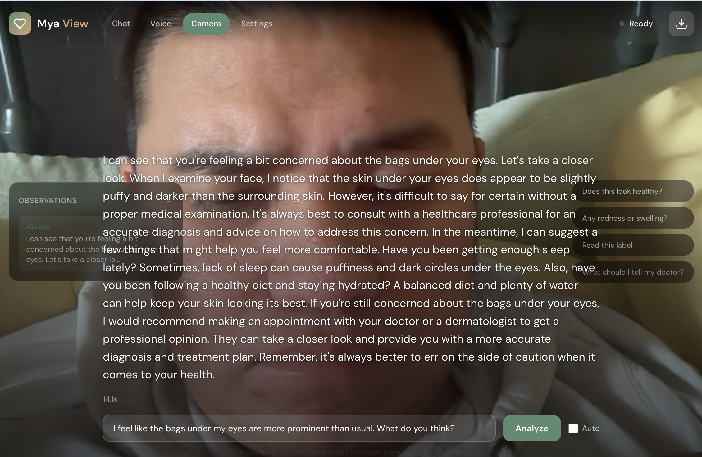

# Mya View (Beta)

Your personal, private health companion. Mya helps you and your family prepare for doctor visits, track conditions and medications, and ask better questions during appointments.

**100% Local & Private** - All AI processing happens on your device via Ollama. Your health data never leaves your machine.

> **Note**: This is the public beta version of Mya View. Contributions and feedback are welcome!


---

## Quick Start

### Prerequisites

- [Docker](https://docs.docker.com/get-docker/) & Docker Compose
- [Ollama](https://ollama.ai/) running locally
- 16GB+ RAM recommended

### 1. Pull Required Models

```bash
# Primary vision/text model
ollama pull llama3.2-vision:11b

# Embedding model for GraphRAG semantic search
ollama pull nomic-embed-text
```

### 2. Clone & Configure

```bash
git clone https://github.com/collinparan/mya_view_beta.git
cd mya_view_beta
cp .env.example .env
```

### 3. Start Services

```bash
cd docker
docker-compose up -d
```

### 4. (Optional) Enable GraphRAG Semantic Search

If you have medical documents to ingest:

```bash
source backend/venv/bin/activate

# Ingest documents into Neo4j graph
python scripts/ingest_documents.py data/uploads/your-name/ --member-id your-id-001

# Generate embeddings for semantic search
python scripts/embed_documents.py
```

See [GRAPHRAG_SETUP.md](GRAPHRAG_SETUP.md) for detailed setup instructions.

### 5. Open the App

Navigate to **http://localhost:8000**

---

## Features

| Feature | Description |
|---------|-------------|
| **Chat** | Natural conversation with Mya about health questions, symptoms, and medications |
| **GraphRAG** | Semantic search across medical history using Neo4j graph + embeddings for context-aware responses |
| **Voice** | Hands-free voice interaction using speech recognition and text-to-speech |
| **Stream** | Live camera analysis for prescriptions, lab results, skin conditions, etc. |
| **Graph Explorer** | Visual exploration of health knowledge graph with relationships and semantic search |
| **Family Profiles** | Track health info for multiple family members with privacy controls |
| **Document Analysis** | Upload and analyze medical documents, prescriptions, and lab results |

### Live Camera Streaming



---

## Architecture

```
┌─────────────────────────────────────────────────────────────────────────────┐
│                              FRONTEND (Browser)                              │
│  ┌────────┐  ┌────────┐  ┌────────┐  ┌────────┐  ┌────────┐                │
│  │  Chat  │  │ Voice  │  │ Stream │  │ Graph  │  │Settings│                │
│  │  UI    │  │   UI   │  │   UI   │  │Explorer│  │   UI   │                │
│  └───┬────┘  └───┬────┘  └───┬────┘  └───┬────┘  └────────┘                │
│      └───────────┴───────────┴───────────┘                                  │
│                     WebSocket/REST API                                       │
└──────────────────────────────┼──────────────────────────────────────────────┘
                               │
┌──────────────────────────────┼──────────────────────────────────────────────┐
│                              ▼                                               │
│                     ┌─────────────────┐                                     │
│                     │   FastAPI App   │                                     │
│                     │   (Port 8000)   │                                     │
│                     └────────┬────────┘                                     │
│                              │                                               │
│       ┌──────────────────────┼──────────────────────┐                       │
│       │                      │                      │                       │
│       ▼                      ▼                      ▼                       │
│  ┌──────────┐       ┌────────────────┐       ┌──────────┐                  │
│  │   LLM    │       │    GraphRAG    │       │ Document │                  │
│  │ Service  │◄──────│    Service     │       │  Service │                  │
│  └────┬─────┘       └────────┬───────┘       └────┬─────┘                  │
│       │                      │                     │                        │
│       │                      │                     │                        │
│       ▼                      ▼                     ▼                        │
│  ┌─────────┐         ┌──────────────┐      ┌─────────────┐                 │
│  │ Ollama  │         │    Neo4j     │      │ PostgreSQL  │  ┌─────────┐    │
│  │ (LLM +  │         │  (Graph +    │      │ + pgvector  │  │  Redis  │    │
│  │Embedder)│         │   Vectors)   │      │ (Vectors)   │  │ (Cache) │    │
│  └─────────┘         └──────────────┘      └─────────────┘  └─────────┘    │
│   :11434                :7688                  :5432           :6379        │
│                                                                             │
│                         BACKEND (Docker Network)                            │
└─────────────────────────────────────────────────────────────────────────────┘

                        ┌──────────────────────┐
                        │       Ollama         │
                        │  ┌────────────────┐  │
                        │  │  llama3.2-     │  │
                        │  │  vision:11b    │  │
                        │  └────────────────┘  │
                        │  ┌────────────────┐  │
                        │  │ nomic-embed-   │  │
                        │  │     text       │  │
                        │  └────────────────┘  │
                        │    (Host System)     │
                        └──────────────────────┘
```

### Data Flow with GraphRAG

```
User Query: "What were my A1C results last year?"
    │
    ▼
┌─────────────────────────────────────────────────────────────┐
│                      LLM Service                             │
│  ┌────────────────────────────────────────────────────┐     │
│  │ 1. Load user's health profile from Neo4j           │     │
│  │    (conditions, medications, allergies)            │     │
│  └────────────────────────────────────────────────────┘     │
│                          │                                   │
│                          ▼                                   │
│  ┌────────────────────────────────────────────────────┐     │
│  │ 2. GraphRAG Retrieval (if enabled)                 │     │
│  │    a. Embed query → [0.023, -0.145, ...]          │     │
│  │    b. Vector search in Neo4j for similar events    │     │
│  │    c. Graph traversal for related entities         │     │
│  │    d. Return: lab results + conditions + meds      │     │
│  └────────────────────────────────────────────────────┘     │
│                          │                                   │
│                          ▼                                   │
│  ┌────────────────────────────────────────────────────┐     │
│  │ 3. Build context-aware prompt                      │     │
│  │    - Mya's caring persona                          │     │
│  │    - User's health profile                         │     │
│  │    - Retrieved medical context (GraphRAG)          │     │
│  └────────────────────────────────────────────────────┘     │
│                          │                                   │
│                          ▼                                   │
│  ┌────────────────────────────────────────────────────┐     │
│  │ 4. Stream response from Ollama                     │     │
│  │    (llama3.2-vision with full context)             │     │
│  └────────────────────────────────────────────────────┘     │
└─────────────────────────────────────────────────────────────┘
    │
    ▼
Response: "Looking at your lab history, your A1C was 5.8%
in November 2024 (down from 6.0% in October). This is still
in the prediabetes range, but showing improvement..."
```

---

## Tech Stack

| Component | Technology | Purpose |
|-----------|------------|---------|
| **LLM** | Ollama + llama3.2-vision:11b | Local AI inference for chat and vision |
| **Embeddings** | Ollama + nomic-embed-text | Semantic search embeddings (768d) |
| **GraphRAG** | neo4j-graphrag-python | Graph + vector hybrid retrieval |
| **Backend** | FastAPI (Python) | REST API and WebSocket endpoints |
| **Graph DB** | Neo4j 5.x | Family relationships, health data, vector indexes |
| **Vector DB** | PostgreSQL 16 + pgvector | Document embeddings storage |
| **Cache** | Redis 7 | Session management, response caching |
| **Frontend** | Vanilla HTML/CSS/JS | Lightweight, no build step required |

---

## Project Structure

```
mya_view/
├── backend/
│   ├── app/
│   │   ├── config.py          # Environment configuration
│   │   ├── models/            # Database models
│   │   │   ├── database.py
│   │   │   └── rag.py         # RAG data models
│   │   ├── routers/           # API endpoints
│   │   │   ├── chat.py
│   │   │   ├── vision.py
│   │   │   ├── graph.py       # Graph explorer API
│   │   │   ├── graph_rag.py   # GraphRAG semantic search API
│   │   │   ├── family.py
│   │   │   └── settings.py
│   │   └── services/
│   │       ├── llm.py         # Ollama LLM integration
│   │       ├── graphrag.py    # GraphRAG service
│   │       ├── embedding.py   # Embedding generation
│   │       └── ingestion.py   # Document parsing
│   ├── static/                # Deployed frontend files
│   └── main.py                # FastAPI app entry point
├── frontend/
│   ├── index.html             # Main chat interface
│   ├── voice.html             # Voice assistant
│   ├── camera.html            # Live vision streaming
│   ├── graph.html             # Graph explorer
│   ├── settings.html          # App settings
│   └── app.js                 # Shared JavaScript
├── docker/
│   ├── docker-compose.yml     # Container orchestration
│   └── init-scripts/          # Database initialization
├── scripts/
│   ├── ingest_documents.py    # Document ingestion into Neo4j
│   ├── embed_documents.py     # Generate embeddings for GraphRAG
│   └── export_checkpoint.py   # Data backup
├── data/                      # Persistent data volumes
├── README.md                  # This file
├── ROADMAP.md                 # Development roadmap
├── GRAPHRAG_SETUP.md          # GraphRAG setup guide
└── GRAPH_VISUALIZATION.md     # Graph features documentation
```

---

## Configuration

Key environment variables (`.env`):

```bash
# Ollama
OLLAMA_HOST=http://host.docker.internal:11434
PRIMARY_VLM=llama3.2-vision:11b
MEDICAL_TEXT_MODEL=llama3.2-vision:11b
EMBEDDING_MODEL=nomic-embed-text

# Neo4j
NEO4J_URI=bolt://neo4j:7687
NEO4J_PASSWORD=changeme_secure_password

# PostgreSQL
POSTGRES_PASSWORD=changeme_secure_password

# API
API_HOST=0.0.0.0
API_PORT=8000

# Features
ENABLE_GRAPHRAG=true
```

---

## Development

### Running Locally (without Docker)

```bash
# Backend
cd backend
python -m venv venv
source venv/bin/activate
pip install -r requirements.txt
uvicorn main:app --reload --port 8000

# Ensure Ollama is running
ollama serve
```

### Deploying Frontend Changes

```bash
# Copy frontend to static folder
cp frontend/*.html backend/static/
cp frontend/*.js backend/static/

# Restart if using Docker
cd docker && docker-compose restart api
```

---

## Privacy & Security

- **Local Processing**: All AI inference runs locally via Ollama
- **No Cloud Dependencies**: Works completely offline after setup
- **Data Ownership**: All data stored in local Docker volumes
- **Family Privacy**: Built-in consent controls for cross-member data access

---

## License

Apache License 2.0 - See [LICENSE](LICENSE) for details.

**Attribution Required**: If you use or distribute this software, please provide attribution to the original author (Collin Paran) and include the [NOTICE](NOTICE) file.

---

## Acknowledgments

- [Ollama](https://ollama.ai/) for local LLM inference and embeddings
- [FastAPI](https://fastapi.tiangolo.com/) for the backend framework
- [Neo4j](https://neo4j.com/) for graph database and vector search
- [neo4j-graphrag-python](https://github.com/neo4j/neo4j-graphrag-python) for GraphRAG implementation
- [pgvector](https://github.com/pgvector/pgvector) for PostgreSQL vector similarity search
- [nomic-embed-text](https://ollama.com/library/nomic-embed-text) for semantic embeddings
